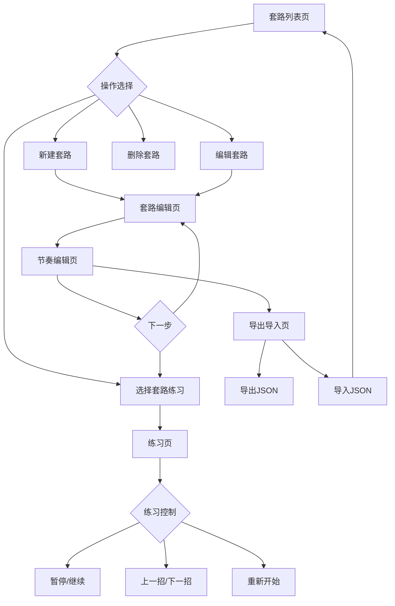

## 1. 产品概述

太极拳套路标注工具是一款纯前端应用，帮助教练将太极拳套路拆分为招式节点，为每个节点设置持续时间、呼吸提示和动作备注，并生成练习节拍器引导学员练习。

- 目标用户：太极拳教练（录入套路）和学员（跟练）
- 核心价值：将口传心授的太极拳节奏数字化，实现可重复、可导出、可跟练的套路节奏管理

## 2. 核心功能

### 2.1 用户角色

| 角色 | 使用方式 | 核心权限 |
|------|----------|----------|
| 教练 | 编辑模式 | 创建/编辑/删除套路，设置招式节奏 |
| 学员 | 练习模式 | 浏览套路库，跟练节拍器 |

### 2.2 功能模块

1. **套路列表页**：套路库增删改查，展示所有已录入套路
2. **套路编辑页**：招式名称录入、拖拽排序
3. **节奏编辑页**：每招时长、呼吸类型（吸/呼/闭）、动作备注
4. **练习页**：大号节拍器视觉/音频提示、当前招式高亮、暂停/上下招切换
5. **导出导入页**：JSON导出含完整节奏、JSON导入并校验格式

### 2.3 页面详情

| 页面名称 | 模块名称 | 功能描述 |
|----------|----------|----------|
| 套路列表页 | 套路卡片列表 | 展示套路名称、招式数、总时长，支持新增/删除/编辑 |
| 套路列表页 | 新建套路弹窗 | 输入套路名称创建新套路 |
| 套路编辑页 | 招式列表 | 显示招式顺序，支持拖拽排序、添加/删除招式 |
| 套路编辑页 | 招式名称编辑 | 内联编辑招式名称 |
| 节奏编辑页 | 时长设置 | 每招秒数设置，滑块+数字输入 |
| 节奏编辑页 | 呼吸标记 | 吸/呼/闭三选一标签 |
| 节奏编辑页 | 动作备注 | 文本输入备注信息 |
| 节奏编辑页 | 总时长汇总 | 自动汇总所有招式时长 |
| 练习页 | 节拍器显示 | 大号视觉倒计时+呼吸提示，Web Audio节拍音 |
| 练习页 | 招式进度条 | 当前招式高亮，已完成招式灰显，未完成招式待定 |
| 练习页 | 控制栏 | 播放/暂停、上一招/下一招、重头开始 |
| 导出导入页 | JSON导出 | 一键导出完整套路JSON（含节奏信息） |
| 导出导入页 | JSON导入 | 粘贴/上传JSON，校验格式后导入套路库 |

## 3. 核心流程

**教练录入流程**：进入列表页 → 新建套路 → 编辑招式序列 → 设置节奏参数 → 预览练习 → 导出JSON

**学员练习流程**：进入列表页 → 选择套路 → 开始练习 → 跟随节拍器练习 → 可暂停/切换招式

**导入流程**：进入导出导入页 → 粘贴或上传JSON → 格式校验 → 导入到套路库

## 4. 用户界面设计

### 4.1 设计风格

- **主题**：中式水墨禅意风格，暗色基调搭配水墨元素
- **主色**：墨黑 (#1a1a2e) + 宣纸白 (#f5f0e8)
- **强调色**：朱砂红 (#c0392b) 用于呼吸提示和高亮，青绿 (#2d6a4f) 用于辅助
- **字体**：标题使用思源宋体风格（Noto Serif SC），正文使用无衬线体
- **按钮风格**：圆角矩形，微妙的阴影和悬浮过渡
- **布局**：卡片式布局，左侧导航栏
- **动画**：招式切换时水墨扩散过渡效果，节拍器呼吸灯效果

### 4.2 页面设计概览

| 页面名称 | 模块名称 | UI元素 |
|----------|----------|--------|
| 套路列表页 | 套路卡片 | 宣纸质感卡片，水墨边框，显示套路名/招式数/总时长 |
| 套路编辑页 | 招式列表 | 竖排卡片，拖拽手柄图标，内联编辑 |
| 节奏编辑页 | 时长滑块 | 自定义水墨风滑块，呼吸三色标签 |
| 练习页 | 节拍器 | 大号圆形呼吸灯，中心显示招式名，呼吸文字提示 |
| 练习页 | 招式进度 | 侧边竖排时间轴，当前招式朱砂红高亮 |
| 导出导入页 | 代码区 | 等宽字体JSON预览，校验结果提示 |

### 4.3 响应式设计

- 桌面端优先，左侧固定导航 + 右侧内容区
- 平板端导航收缩为顶部标签
- 手机端全屏内容 + 底部导航
- 练习页支持触摸操作（点击屏幕暂停/继续）

### 4.4 3D场景指导

不适用
