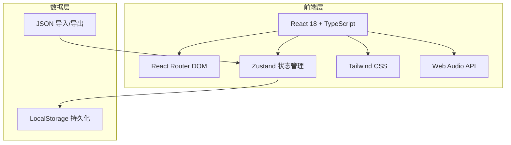
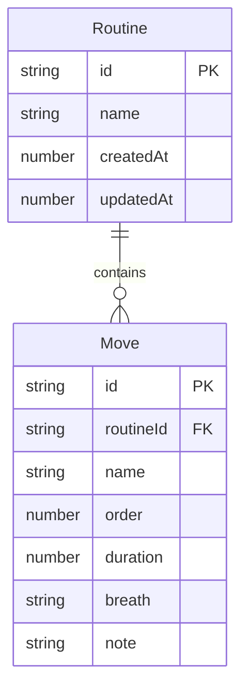

## 1. 架构设计



纯前端架构，无后端服务。所有数据存储在浏览器 LocalStorage，通过 JSON 文件实现数据导入导出。

## 2. 技术说明

- **前端框架**：React@18 + TypeScript + Vite
- **初始化工具**：vite-init (react-ts 模板)
- **路由**：react-router-dom@6
- **状态管理**：zustand
- **样式**：tailwindcss@3
- **音频**：Web Audio API（原生浏览器API，无需额外依赖）
- **拖拽**：@dnd-kit/core + @dnd-kit/sortable（轻量级拖拽库）
- **图标**：lucide-react
- **后端**：无
- **数据库**：无（使用 LocalStorage）

## 3. 路由定义

| 路由 | 用途 |
|------|------|
| `/` | 套路列表页，展示所有套路 |
| `/routine/:id/edit` | 套路编辑页，招式名称和拖拽排序 |
| `/routine/:id/rhythm` | 节奏编辑页，每招时长/呼吸/备注 |
| `/routine/:id/practice` | 练习页，节拍器和招式高亮 |
| `/routine/:id/export` | 导出导入页，JSON导出和导入 |

## 4. API 定义

无后端API。所有数据操作通过 Zustand store 直接操作 LocalStorage。

## 5. 服务器架构图

不适用

## 6. 数据模型

### 6.1 数据模型定义



### 6.2 数据定义

```typescript
interface Routine {
  id: string
  name: string
  moves: Move[]
  createdAt: number
  updatedAt: number
}

interface Move {
  id: string
  name: string
  order: number
  duration: number
  breath: 'inhale' | 'exhale' | 'hold'
  note: string
}

interface RoutineExport {
  version: string
  routine: {
    name: string
    moves: Array<{
      name: string
      order: number
      duration: number
      breath: 'inhale' | 'exhale' | 'hold'
      note: string
    }>
  }
}
```

### 6.3 LocalStorage 存储结构

- Key: `taichi-routines`
- Value: JSON 序列化的 `Routine[]`

### 6.4 JSON 导入校验规则

1. 必须包含 `version` 字段，值为 `"1.0"`
2. 必须包含 `routine` 对象，含 `name` 和 `moves` 数组
3. 每个 move 必须含 `name`、`duration`、`breath` 字段
4. `breath` 只能为 `"inhale"`、`"exhale"`、`"hold"` 之一
5. `duration` 必须为正数
6. `moves` 数组不能为空
